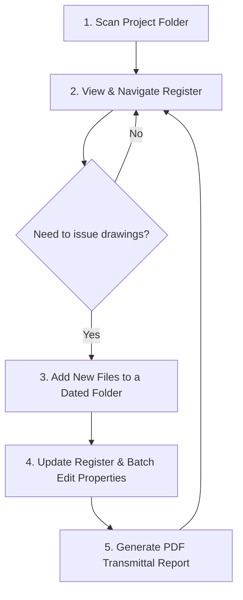
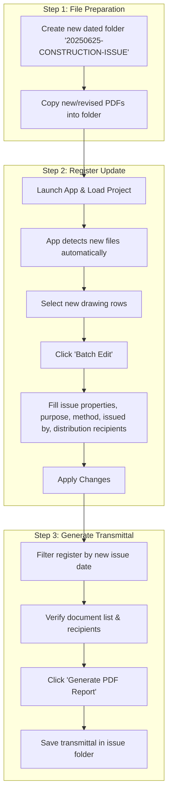

# Drawing Register Application
## Complete User Guide & Tutorial

---

## 📋 Table of Contents

1. [🎯 What is the Drawing Register Application?](#what-is-the-drawing-register-application)
2. [✨ Key Benefits & Core Features](#key-benefits--core-features)
3. [🚀 Getting Started](#getting-started)
4. [📊 Understanding the Interface](#understanding-the-interface)
5. [📂 Project Setup Workflow](#project-setup-workflow)
6. [📋 Daily Operations](#daily-operations)
7. [📤 Document Distribution & Transmittals](#document-distribution--transmittals)
8. [⚙️ Advanced Features](#advanced-features)
9. [🔧 Troubleshooting & FAQ](#troubleshooting--faq)
10. [💡 Best Practices](#best-practices)

---

## 🎯 What is the Drawing Register Application?

The Drawing Register Application is a **Windows desktop tool** designed for structural engineering firms and construction companies to manage, track, and distribute structural drawings and technical documents throughout a project lifecycle. It provides a centralized system for document revision control, distribution management, and professional reporting.

### Core Purpose
The application automates and standardizes three critical processes:
- **📁 Creating and maintaining** a live drawing register for projects
- **📝 Tracking revision history** of every document with full audit trails
- **📧 Generating formal document transmittals** for new issues and distributions

---

## ✨ Key Benefits & Core Features

### 🎯 Primary Benefits
| Benefit | Description |
|---------|-------------|
| **⏱️ Time Savings** | Batch operations and automated scanning reduce manual work by 80% |
| **🔍 Centralized Control** | All project documents in one location with consistent metadata |
| **📋 Audit Trail** | Complete history of who received what documents and when |
| **📄 Professional Reports** | Generate client-ready transmittals and distribution lists |
| **✅ Compliance** | Maintain proper document control standards required in engineering |

### 🛠️ Main Features

#### **Document Management**
- Organize and track structural drawings, calculations, specifications, and technical documents
- Automatic document scanning from folder structures
- Revision control with complete history tracking
- Professional PDF reports and transmittals

#### **Distribution Tracking**
- Monitor document distribution to stakeholders
- Batch distribution operations
- Company/stakeholder management
- Distribution status visualization

#### **Project Organization**
- Group documents by project with metadata
- Project numbers, disciplines, and client information
- Save and load project data for continued work

---

## 🚀 Getting Started

### 📥 Initial Setup (One-Time Only)

1. **Install Application Shortcut**
   - Navigate to: `\\srmjfp01\data\05 - LIBRARY\07 - SOFTWARE\MJ SCRIPTS\DrawingRegister`
   - Find: `DrawingRegister.apprev - Shortcut`
   - Right-click → **Copy** → Paste to your desktop

2. **System Requirements**
   - Windows 10/11
   - .NET 8.0 Framework
   - Local file system access
   - PDF viewer (Bluebeam Revu recommended)

### 🎯 High-Level Workflow Overview



---

## 📊 Understanding the Interface

### 🖥️ Main Window Layout

```
┌─ Project Metadata Section ─────────────────────────────────────┐
│ Project No: [____] Name: [_____________] Discipline: [_______] │
│ Register No: [___] Client No: [______]                        │
└───────────────────────────────────────────────────────────────┘
┌─ Filter & Search Tools ────────────────────────────────────────┐
│ Search: [________] Filter By: [Dropdown] Date: [_______]      │
└───────────────────────────────────────────────────────────────┘
┌─ Main Document Grid ───────────────────────────────────────────┐
│ Doc No │ Description       │ Type │ Rev │ 03/02/2025 │ 11/04/2025 │  │
│ 17749-M+J-V1-F1-DR-S-16-01│ Foundation Plan   │ DRG  │ C01 │     T01    │     C01    │  │
│ 17749-M+J-V1-L0-DR-S-23-01│ Ground Floor Plan │ DRG  │ C01 │            │     C01    │  │
└───────────────────────────────────────────────────────────────┘
┌─ Action Buttons & Distribution Summary ────────────────────────┐
│ [Import] [Edit] [Batch Edit] [Generate Report] [Distribution] │
└───────────────────────────────────────────────────────────────┘
```

### 🔍 Key Interface Elements

| Element | Function | Tips |
|---------|----------|------|
| **Document Grid** | Central table showing all documents and revisions | Double-click revision cells to open PDFs |
| **Dynamic Columns** | Auto-generated columns for each issue date | Click headers to filter by issue date |
| **Search Tools** | Multiple search options for quick document finding | Use document number, description, or type |
| **Action Buttons** | Primary functions for document management | Most operations work on selected rows |

---

## 📂 Project Setup Workflow

### 🆕 Setting Up a New Project

#### Step 1: Launch & Configure Project
1. **Launch Application** from desktop shortcut
2. **Enter Project Metadata:**
   - Project Number (e.g., "17749")
   - Project Name (e.g., "Glendroanch Warehouse Complex")
   - Discipline (e.g., "Structural Engineering")
   - Register Number (if applicable)
   - Client Number (if applicable)

#### Step 2: First-Time Folder Scan
1. Click **"Scan Outgoing Folder"** button
2. Navigate to your project's drawing issues folder
   - ⚠️ **Critical:** Select the **root folder** containing all dated sub-folders
   - ✅ **Correct:** `\\srmjfp01\data\02-PROJECTS\17700 - FILES\17749\02 - ENG\02 - DRAWINGS\03 - OUTGOING\01 - PDF`
   - ❌ **Incorrect:** `...\01 - PDF\20250203-TENDER-ISSUE`
3. Click **"Select Folder"**

#### Step 3: Initial Processing
- Application scans all sub-folders and PDF files
- Parses filenames and builds historical register
- Creates `project_data.json` file for fast future loading
- ⏱️ **Note:** First scan may take time for large projects, but subsequent loads are instant

### 📁 Expected Folder Structure

```
\\srmjfp01\data\02-PROJECTS\17700 - FILES\17749\02 - ENG\02 - DRAWINGS\03 - OUTGOING\01 - PDF
├── project_data.json (created by app)
├── distribution_list.json (created by app)
├── 20250203-TENDER-ISSUE/
│   ├── 17749-M+J-S1-XX-DR-S-00-01-T01-GENERAL-NOTESHEET 1.pdf
│   ├── 17749-M+J-V1-F1-DR-S-16-01-T01-WAREHOUSE-FOUNDATION-PLAN.pdf
│   └── 17749-M+J-V1-XX-DR-S-28-01-T01-WAREHOUSE-ELEVATIONSHEET-1.pdf
├── 20250411_CONSTRUCTION ISSUE_C01/
│   ├── 17749-M+J-V1-F1-DR-S-16-01-C01-WAREHOUSE-FOUNDATION PLAN.pdf
│   ├── 17749-M+J-V1-L0-DR-S-23-01-C01-WAREHOUSE-GROUND FLOOR PLAN.pdf
│   └── 17749-M+J-V1-XX-DR-S-28-01-C01-WAREHOUSE-ELEVATIONSHEET 1.pdf
└── 20250415-CONSTRUCTION ISSUE/
    ├── 17749-M+J-V1-F1-DR-S-16-01-C01-WAREHOUSE-FOUNDATION PLAN.pdf
    └── Transmittal_17749-M+J-00-XX-RE-Z-00-01_20250415.pdf
```

---

## 📋 Daily Operations

### 🔍 Navigating the Drawing Register

#### **Viewing Documents**
- **View All Revisions:** Main grid shows complete revision history chronologically
- **Open PDFs:** Double-click any revision cell (e.g., `C01`) to open in Bluebeam Revu
- **Filter by Issue:** Click column headers (issue dates) to view specific transmittals
- **Search Documents:** Use search tools to find specific drawings quickly

#### **Understanding the Display**
| Visual Element | Meaning |
|----------------|---------|
| **Colored Cells** | Revision indicators with purpose-based colors |
| **Issue Date Columns** | Automatically generated for each distribution date |
| **Empty Cells** | Document not included in that issue |
| **Bold Text** | Latest revision of each document |

### 📝 Document Management Operations

#### **Individual Document Editing**
1. Select document row in main grid
2. Click **"Edit Document"** button
3. Modify properties in dialog:
   - Document number and description
   - Document type and package
   - Notes and additional metadata
4. Click **"Save"** to confirm changes

#### **Adding New Revisions**
1. Select document row
2. Click **"Add Revision"** or edit existing revision
3. Fill revision details:
   - Revision number (e.g., A01, B01, C01)
   - Issue date and purpose
   - Issue method and responsible person
4. Save changes

### 🔄 Refreshing and Updates

| Action | When to Use | Button/Method |
|--------|-------------|---------------|
| **Refresh View** | Return to full unfiltered register | "Refresh View" button |
| **Re-scan Folder** | After adding new files to project | "Scan Outgoing Folder" |
| **Reload Project** | After external changes to files | Restart application |

---

## 📤 Document Distribution & Transmittals

### 🎯 Complete Transmittal Workflow

This is the most powerful feature for issuing new documents with proper documentation.

#### **Transmittal Process Diagram**


#### **Step-by-Step Instructions**

##### **📁 Step 1: Prepare Files**
1. Navigate to project's structural drawing issue folder (e.g., `\\srmjfp01\data\02-PROJECTS\17700 - FILES\17749\02 - ENG\02 - DRAWINGS\03 - OUTGOING\01 - PDF`)
2. Create **new sub-folder** with naming convention:
   - Format: `YYYYMMDD-PURPOSE-DESCRIPTION` or `YYYYMMDD_PURPOSE ISSUE_RevCode`
   - Examples: `20250625-CONSTRUCTION-ISSUE`, `20250630_TENDER ISSUE_T02`
3. Copy all new/revised PDFs into this folder

##### **💻 Step 2: Update Register**
1. **Launch application** and load project
2. **Automatic Detection:** App finds new folder and files
3. **Select Documents:** Choose all rows for the new issue (Ctrl+Click for multiple)
4. **Batch Edit Properties:**
   - Click **"Batch Edit"** button
   - Select correct **Issue Date/Folder**
   - Enter **Purpose** (Construction, Tender, Planning, Information, etc.)
   - Enter **Method** (Email, SharePoint, Hand Delivery, Teams, etc.)
   - Enter **Issued By** (your initials)
   - **Distribution:** Check boxes for recipient companies
5. **Apply Changes** to save information

##### **📄 Step 3: Generate Transmittal**
1. **Filter by Issue:** Click new issue date column header
2. **Verify Information:** Check document list and distribution details
3. **Generate Report:** Click **"Generate PDF Report"**
4. **Save Transmittal:** Save PDF in the same issue folder

### 📊 Distribution Management

#### **Managing Company List**
- Click **"Manage Distribution"** to access company database
- **Add Company:** Include name, type, contact details
- **Company Categories:** Client, General Contractor, Structural Consultant, Steel Fabricator, etc.
- **Global List:** Available across all projects

#### **Distribution Tracking**
- Mark which documents go to which companies
- Track distribution dates and methods
- View distribution summary by issue
- Generate distribution reports

---

## ⚙️ Advanced Features

### 🔧 Batch Operations

#### **Batch Editing Multiple Documents**
1. Select multiple documents (Ctrl+Click or Shift+Click)
2. Click **"Batch Edit"** button
3. Common operations:
   - Update issue dates and purposes
   - Change distribution recipients
   - Modify document types or packages
   - Add common notes or descriptions

#### **Batch Distribution Updates**
- Select documents from specific issue
- Update distribution status for multiple companies
- Generate bulk transmittals
- Export distribution lists

### 📈 Reporting & Analytics

#### **Available Reports**
| Report Type | Purpose | Output |
|-------------|---------|--------|
| **Project Register** | Complete document listing | PDF with full revision history |
| **Issue Transmittal** | Distribution documentation | Professional transmittal letter |
| **Distribution Summary** | Status tracking | Who received what and when |
| **Custom Filtered** | Specific requirements | Date/type/company filtered lists |

#### **Report Customization**
- Filter by date ranges
- Include/exclude specific document types
- Company-specific reports
- Custom formatting options

### 💾 Data Management

#### **File Storage System**
| File | Location | Purpose |
|------|----------|---------|
| **`project_data.json`** | Project folder | Document metadata and history |
| **`distribution_list.json`** | Project folder | Company and stakeholder list |
| **`output.log`** | Application folder | System logs and error tracking |

#### **Data Import/Export**
- Import from existing spreadsheets
- Export to Excel for external use
- Backup and restore project data
- Migrate between project folders

---

## 🔧 Troubleshooting & FAQ

### ❓ Common Issues & Solutions

#### **📄 Document Display Issues**

**Q: New drawing isn't showing up in register**
- ✅ **Solution:** Ensure PDF is in a dated sub-folder within scanned directory
- ✅ **Action:** Click "Refresh View" or re-scan folder
- ⚠️ **Note:** App only scans on startup or manual refresh

**Q: PDF won't open when double-clicked**
- ✅ **Check:** File path is correct and PDF exists
- ✅ **Check:** PDF is not corrupted or password-protected
- ✅ **Check:** Bluebeam Revu or PDF viewer is installed

#### **⚡ Performance Issues**

**Q: Initial scan is very slow**
- ✅ **Normal:** First scan builds complete database from scratch
- ✅ **Expected:** Large projects (1000+ files) may take several minutes
- ✅ **Future:** Subsequent loads will be nearly instant

**Q: Application becomes unresponsive**
- ✅ **Check:** Available disk space for project_data.json file
- ✅ **Check:** Network connectivity if project is on network drive
- ✅ **Action:** Restart application and try smaller batch operations

#### **📊 Data & Sync Issues**

**Q: Changes aren't saving properly**
- ✅ **Check:** Write permissions to project folder
- ✅ **Action:** Save project manually before closing
- ✅ **Verify:** project_data.json file timestamp updates

**Q: Distribution list disappeared**
- ✅ **Check:** distribution_list.json file exists in project folder
- ✅ **Action:** Re-create companies using "Manage Distribution"
- ✅ **Backup:** Export distribution list for future projects

#### **📤 Transmittal Generation Issues**

**Q: Report generation fails**
- ✅ **Check:** All required project metadata is filled
- ✅ **Check:** Documents have proper issue dates assigned
- ✅ **Check:** Distribution companies are selected
- ✅ **Action:** Try filtering to smaller document set

**Q: Wrong documents in transmittal**
- ✅ **Check:** Correct issue date filter is applied
- ✅ **Verify:** Documents have correct issue date assigned
- ✅ **Action:** Use "Refresh View" then re-filter by date

### 🚨 Error Recovery

#### **Corrupted Project Data**
1. Backup existing project_data.json
2. Delete corrupted file
3. Re-scan folder to rebuild database
4. Re-enter custom metadata as needed

#### **Missing Files**
1. Verify folder structure matches expected format
2. Check file permissions and network connectivity
3. Use "Refresh View" to re-scan for changes
4. Manually relocate files if folder structure changed

---

## 💡 Best Practices

### 📁 File Organization

#### **Folder Naming Conventions**
```
✅ Good Examples:
- 20250203-TENDER-ISSUE
- 20250411_CONSTRUCTION ISSUE_C01
- 20250415-CONSTRUCTION ISSUE
- 20250418-PLANNING-DRAWINGS
- 20250520-CONSTRUCTION-ISSUE

❌ Avoid These:
- NewFiles (no date)
- 15-03-2024 (inconsistent format)  
- Foundation Issue March (no date code)
```

#### **Document Naming Standards**
```
✅ M+J Company Format:
- 17749-M+J-V1-F1-DR-S-16-01-C01-WAREHOUSE-FOUNDATION PLAN.pdf
- 17749-M+J-V1-L0-DR-S-23-01-C01-WAREHOUSE-GROUND FLOOR PLAN.pdf
- 17749-M+J-V1-XX-DR-S-28-01-C01-WAREHOUSE-ELEVATIONSHEET 1.pdf

📋 Elements to Include:
- Project Number (17749)
- Company Code (M+J)
- Building/Volume (V1)
- Level (F1=Foundation, L0=Ground, etc.)
- Document Type (DR=Drawing)
- Discipline (S=Structural)
- Sheet Number (16-01)
- Revision Code (C01=Construction Issue 01, T01=Tender Issue 01)
- Description (WAREHOUSE-FOUNDATION PLAN)
```

### 🎯 Workflow Efficiency

#### **Daily Operations**
| Frequency | Task | Best Practice |
|-----------|------|---------------|
| **Daily** | Check for new files | Use "Refresh View" button |
| **Weekly** | Update distribution status | Batch edit for efficiency |
| **Per Issue** | Generate transmittals | Filter by date first |
| **Monthly** | Backup project data | Copy JSON files to safe location |

#### **Project Setup**
1. **Complete metadata first** before importing documents
2. **Set up distribution companies** before first transmittal
3. **Establish folder conventions** early in project
4. **Train team members** on consistent file naming

### 📊 Quality Control

#### **Before Each Transmittal**
- [ ] Verify all documents have correct revision numbers
- [ ] Check issue dates match folder dates
- [ ] Confirm distribution list is complete and accurate
- [ ] Preview generated report before sending
- [ ] Save transmittal PDF in issue folder

#### **Regular Maintenance**
- [ ] Keep distribution company list updated
- [ ] Remove obsolete or superseded documents
- [ ] Verify file paths remain valid
- [ ] Monitor application log for errors
- [ ] Backup project data regularly

### 🔄 Team Collaboration

#### **Multi-User Environment**
- **Shared Network Storage:** Store projects on accessible network drives
- **Consistent Conventions:** Establish company-wide naming standards
- **Version Control:** Use application's revision tracking, not file versions
- **Communication:** Document any manual corrections or special cases

#### **Handover Procedures**
- **Complete Documentation:** Ensure all metadata is current
- **File Organization:** Verify folder structure is clean and logical
- **Distribution Records:** Confirm all transmittals are properly recorded
- **Training:** Brief new users on project-specific conventions

---

## 📞 Support & Resources

### 🛠️ Technical Support
- **Application Logs:** Check `output.log` for detailed error messages
- **File Locations:** Verify paths and permissions for project folders
- **System Requirements:** Ensure Windows and .NET versions are compatible

### 📚 Additional Resources
- **Network Location:** `\\srmjfp01\data\05 - LIBRARY\07 - SOFTWARE\MJ SCRIPTS\DrawingRegister`
- **Documentation:** This guide and any company-specific procedures
- **Training:** Hands-on sessions available for new users

---

*This guide provides comprehensive coverage of the Drawing Register Application. For additional support or feature requests, contact your IT administrator or project management team.* 